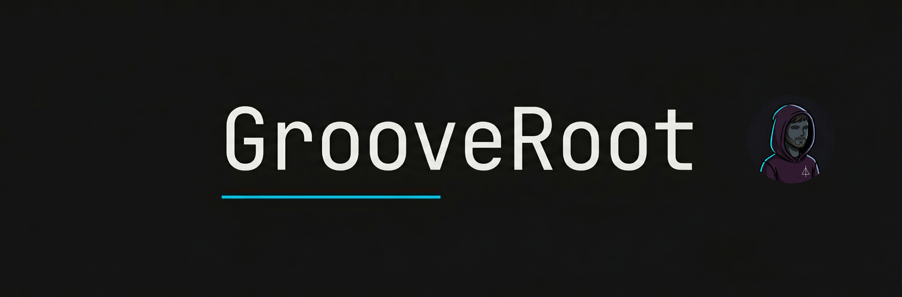

# Carlos Macías

Bartender transitioning into cybersecurity. I learn by breaking things in controlled environments and documenting what I find.

Currently working through TryHackMe and building toward **CompTIA Security+**, with HackTheBox next on the list. Long-term target is a SOC Analyst or Jr. Sysadmin role, with a preference for offensive work.

---

## What's in here

**[Security-Labs](https://github.com/GrooveRoot/Security-Labs)** — CTF write-ups from TryHackMe and DockerLabs. Rooted manually, documented with methodology: recon → enumeration → foothold → post-exploitation. Not just what worked, but why the vulnerability existed.

**[Active Directory Home Lab](https://github.com/GrooveRoot/active-directory-home-lab)** — Built a Windows Server 2022 domain from scratch. Domain controller, Win11 client, GPOs, SMB/NTFS permissions. The kind of environment you actually encounter in a real network.

---

## Stack

Fedora / Distrobox (Kali) / OpenVPN — Nmap, Gobuster, Hydra, John the Ripper, Metasploit, smbclient, SecLists

---

[LinkedIn](https://www.linkedin.com/in/carlosmacias29/)
